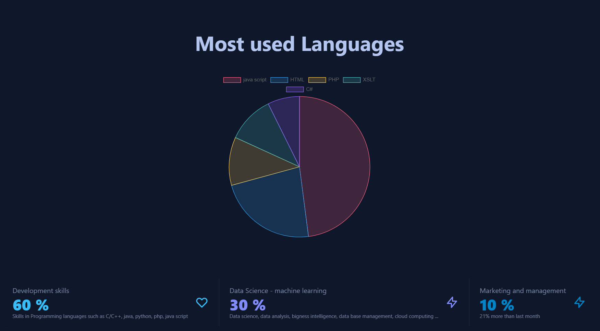
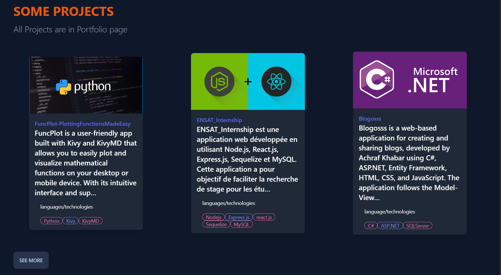
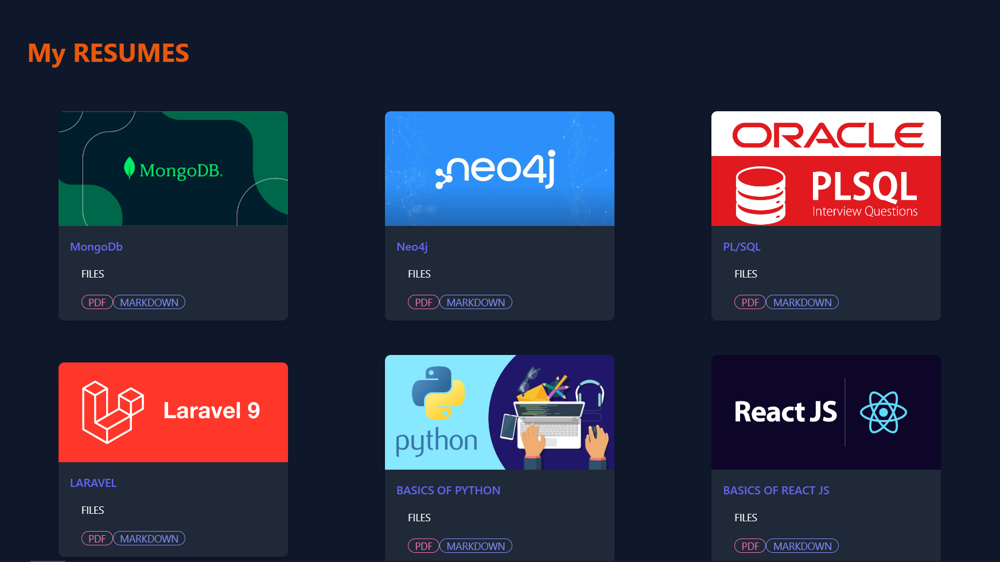

Personal Website 
================

This is the source code for my personal website built using React JS. The website showcases my portfolio, my projects, my notes and my personal informations.

visit the site : <a href="achrafkhabar.com">Achraf Khabar</a>

###  React JS

###  Tailwind CSS

###  CSS

###  DaisyUI using <a href="https://daisyui.com/">DaisyUI</a> or <a href="https://github.com/saadeghi/daisyui">github</a>

###  NPM

About
-----

This website is built using React JS, tailwind CSS, daisyUI library . It features a responsive design that looks great on all devices. Visitors can navigate through my portfolio and project posts, as well as learn more about me and my skills.

Getting Started
---------------

To get started with this project, follow these steps:

1.  Clone the repository to your local machine using `git clone https://github.com/Ashraf-Khabar/Portfolio`.

2.  Navigate to the project directory using `cd Portfolio`.

3.  Install the required dependencies using `npm install`.

4.  Start the development server using `npm start`.

5.  Open your web browser and navigate to `http://localhost:3000` to view the website.

Screenshots
-----------

  

Contributing
------------

If you find a bug or would like to suggest a new feature, please open an issue on the repository. Pull requests are also welcome.

License
-------

This project is licensed under the MIT License - see the `LICENSE` file for details.
